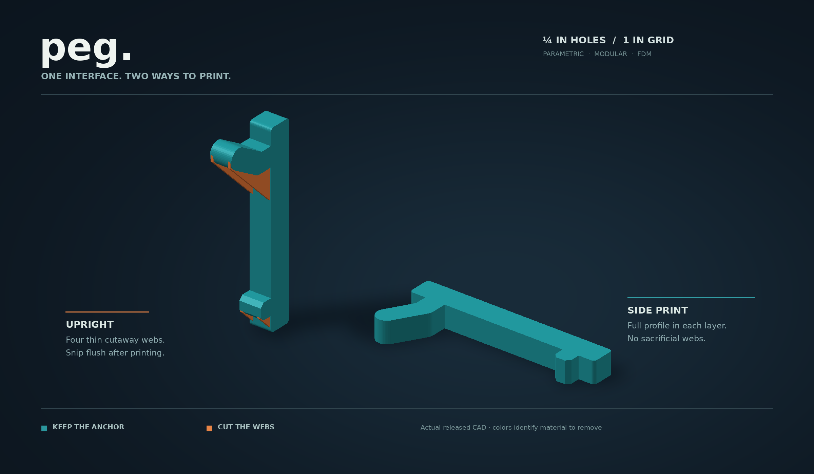
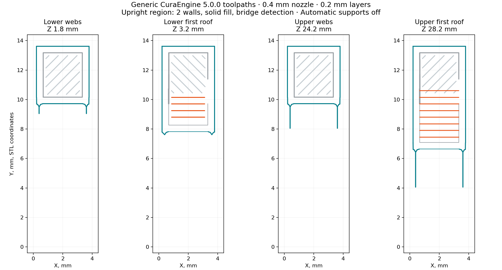
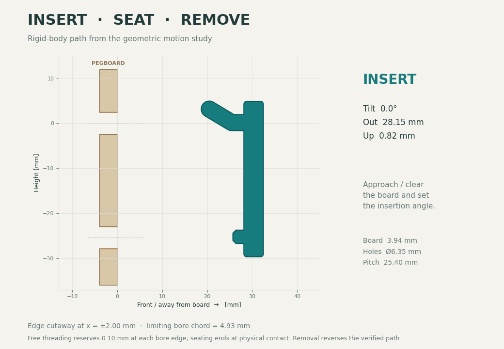
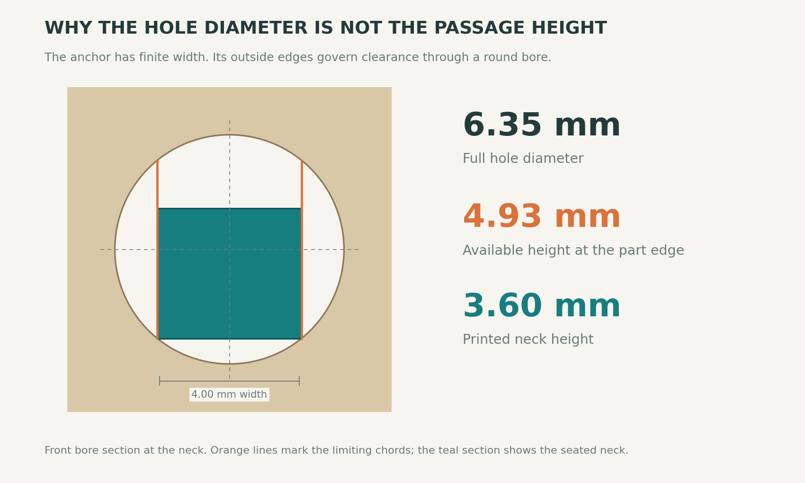
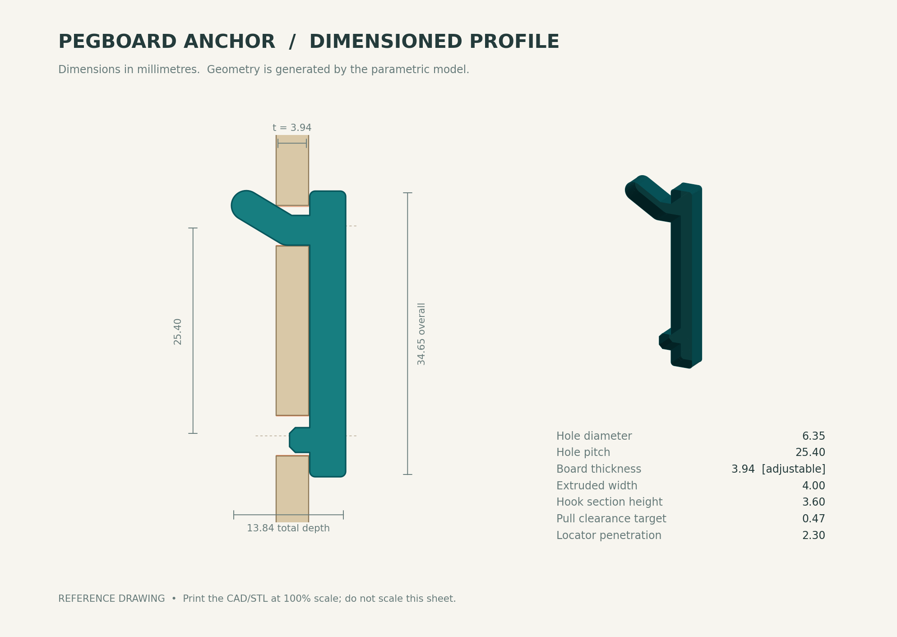

# Rectangular baseline — project guide

> Historical rectangular-neck version. See [README.md](README.md) and [HANDOFF.md](HANDOFF.md) for the current round geometry, downloads, and continuation instructions.

A parametric FDM attachment for US pegboard with **1/4-inch holes on a 1-inch grid**. Fuse its front spine into a tool holder, bin, bracket, or shelf. The upper tongue retains the mount behind the board; the lower locator controls rotation. The finished interface supports two printing routes: flat on its side, or upright with four sacrificial webs that you cut away.



**Start with the [two-option 3MF](Pegboard_Print_Options.3mf?raw=1) and print a fit sample.** It contains the current flat and upright models in their printing orientations. This is a **geometry-only 3MF**: select your printer and filament, keep the option you want, and slice it. It contains no printer profile or G-code.


## Current printable files

| Task | File | What you receive |
|---|---|---|
| Compare both print orientations | [Pegboard_Print_Options.3mf](Pegboard_Print_Options.3mf?raw=1) | Two separate objects already placed on the bed; geometry only |
| Print flat | [Flat STL](cad/anchor_default_3p94mm.stl?raw=1) | Bare anchor, broad side on the bed; no supports for this isolated part |
| Print upright | [Supported STL](cad/anchor_upright_supported.stl?raw=1) | One fused solid, standing on the bed, with four cutaway webs |
| Add the interface to your CAD | [Functional STEP](cad/anchor_default_3p94mm.step?raw=1) | Finished anchor in design coordinates |
| Add upright printing supports to your CAD | [Supported STEP](cad/anchor_upright_supported.step?raw=1) | Anchor and sacrificial webs fused into one solid |
| Inspect what to remove | [Cutaway reference STEP](cad/upright_cutaway_reference.step?raw=1) | Separate retained body and colored sacrificial webs; an inspection assembly |
| Start a wider holder | [Two-column STEP](cad/two_column_example.step?raw=1) | Two anchors on the 25.4 mm grid, joined by a small front bridge |

All dimensions are millimeters. **STEP preserves solid geometry; it does not provide a native parametric feature history in Onshape, Fusion, or FreeCAD.** The editable model lives in the Python source. The OpenSCAD module provides the functional anchor; the upright sacrificial supports currently come from Python.

The default targets **3.94 mm actual board thickness**, **6.35 mm holes**, and **25.4 mm spacing**. Measure your board and holes before printing a complete holder. Use the table below to select another exported preset, or change the parameters and recheck its motion. GitHub's **Code → Download ZIP** downloads the source, models, studies, and illustrations together.

## Choose the print orientation

**Print flat when the host permits it.** Each layer contains the full bent tongue-and-neck profile; the 4 mm width becomes the build height. The supplied flat STL already has this orientation. Use five walls as the starting configuration, then inspect the neck and tongue to confirm that they slice effectively solid.

**Print upright when the host needs to stand on the bed.** Two 0.50 mm webs support each projection, four webs total. Their 45° lower edges grow out from the spine. Each web sits 0.15 mm inside the outside face, leaving a 2.70 mm bridge across the width. They add about 22.6 mm³ of plastic and must come off before installation. Print everything in one filament; the orange in the drawing identifies material to remove.

For the upright anchor, start with a **local modifier using two walls and 100% line infill**. The successful generic slicing check used these settings to leave room for bridge skin across the roofs. Applying five walls indiscriminately filled the narrow roofs with nested perimeter loops. The larger host can keep its own wall settings. Use a brim for the isolated upright sample; the host may supply enough bed contact by itself.

Hold the spine and use flush cutters from each outside face. Snip each web's root and roof, then trim all remnants flush with the original functional surfaces. **Do not twist the tongue to break a web loose.** Preserve the outside bearing corners and test the trimmed sample in the board.

See [PRINTING_OPTIONS.md](PRINTING_OPTIONS.md) for integration, removal, and setup details, and [SLICER_CHECK.md](SLICER_CHECK.md) for the actual toolpath review.

### What the slicer check established

We ran **CuraEngine 5.0.0** with generic Cura FDM definitions, a 0.4 mm nozzle, 0.45 mm nominal line width, 0.20 mm layers, and automatic supports off.

| Check | Flat | Upright with cutaway webs |
|---|---:|---:|
| Walls | 5 | 2 |
| Infill | 30% requested; narrow geometry mostly walls | 100% lines |
| Layers | 20 | 173 |
| Connected model footprints on first layer | 1 | 1 |
| Wholly detached deposition components found | 0 | 0 |
| Standalone brim | Not required by this review | 6 mm |

The actual upright toolpaths preserve all four thin webs. The first lower and upper roofs use X-directed extrusion paths; their checked centerline spans were 2.241 and 2.650 mm. These path lengths differ from the 2.70 mm geometric gap because the slicer places perimeter paths and overlaps infill.



The geometric layer-growth check covers all five board/hole presets at four layer phases. The deposited-component check catches wholly detached components; it does not prove that every span prints cleanly. This generic Cura review is **not a Bambu Studio or OrcaSlicer profile**, and its review G-code is not a printable deliverable. Inspect the final host in your own slicer. Upright supports solve deposition beneath the projections; the layer orientation still needs its own physical strength check.

## Board fit and US thickness presets

The **1/4-inch hook family describes the hole size**, not a guarantee of 1/4-inch panel thickness. US retail panels commonly appear in nominal 1/8-, 3/16-, and 1/4-inch families, with nominal and actual thickness often differing.

Home Depot and Lowe's list several nominal 3/16-inch hardboard panels at **0.155 inch actual thickness**, or 3.937 mm. That assortment supports **3.94 mm as the practical default for this model**. It does not establish a national sales majority. Actual 0.165-inch stock and true 1/4-inch panels also occur. Some Lowe's DPI panels specify 9/32-inch holes. Product evidence and links are collected in [research.md](research.md).

| Measured board | Measured holes | Flat STL | Functional STEP |
|---|---|---|---|
| **3.94 mm — default** | 6.35 mm / 1/4 in | [STL](cad/anchor_default_3p94mm.stl?raw=1) | [STEP](cad/anchor_default_3p94mm.step?raw=1) |
| 4.19 mm / 0.165 in | 6.35 mm / 1/4 in | [STL](cad/anchor_4p19mm.stl?raw=1) | [STEP](cad/anchor_4p19mm.step?raw=1) |
| 4.7625 mm / true 3/16 in | 6.35 mm / 1/4 in | [STL](cad/anchor_4p7625mm.stl?raw=1) | [STEP](cad/anchor_4p7625mm.step?raw=1) |
| 6.35 mm / true 1/4 in | 6.35 mm / 1/4 in | [STL](cad/anchor_6p35mm.stl?raw=1) | [STEP](cad/anchor_6p35mm.step?raw=1) |
| 3.94 mm | 7.14375 mm / 9/32 in | [STL](cad/anchor_3p94mm_9over32_holes.stl?raw=1) | [STEP](cad/anchor_3p94mm_9over32_holes.step?raw=1) |

The exported supported STL and 3MF use the default board. Generate an upright model with matching parameters for another board. Nominal 1/8-inch pegboard often belongs to the smaller-hole family; those retail panels are not covered by the supplied 1/4-inch-hole presets.

## Insertion, seating, and removal



1. Start in front of the board with the bottom of the mount tipped toward you.
2. Set about **19.25°** tilt for the default board. Feed the rounded upper tongue through the upper hole.
3. Rotate and translate the body down along the illustrated path. Align the lower locator with the hole one row below, then ease the part into its bearing contacts.
4. Remove it by releasing those contacts and reversing the tilt, lift, and withdrawal. No printed snap latch needs to flex.

The default path rises **0.82 mm** above the final seated position and sweeps **5.55 mm behind the board's rear face**. Keep that region unobstructed. A nominal 12 mm clear standoff provides room beyond the computed bare-anchor sweep; wall irregularities, spacers, and the attached host can require more. A batten behind an occupied hole blocks the path regardless of the rest of the board's spacing.

### Motion results

| Actual board, mm | Bore, mm | Maximum tilt | Maximum lift, mm | Dense checked poses | Continuous sweep |
|---:|---:|---:|---:|---:|---|
| 3.940 | 6.350 | 19.25° | 0.82 | 1,962 | Pass |
| 4.190 | 6.350 | 19.25° | 0.92 | 1,963 | Pass |
| 4.7625 | 6.350 | 19.75° | 1.17 | 1,986 | Pass |
| 6.350 | 6.350 | 20.00° | 1.77 | 2,007 | Pass |
| 3.940 | 7.14375 | 9.75° | 0.22 | 1,551 | Pass |

The study includes the complete upper tongue, spine, and lower locator through approach, threading, rotation, bearing contact, and reverse removal. A 4 mm-wide extrusion cannot use the full centerline height of a 6.35 mm circular bore. Its limiting opening is:

```text
effective height = sqrt(hole_diameter² − width²) = 4.932 mm
```



For this constant-width shape and planar motion, that opening accounts for the full extrusion width. The free-motion checker reserves 0.10 mm at each vertical bore edge and proves separation between waypoints with recursive rigid-body displacement bounds. The final translation uses an exact polygon sweep that permits intended zero-gap bearing contact. Dense sampling separately limits point travel to 0.025 mm. Reversing the verified path traverses the same swept volume.

An independent OpenCascade check found **zero interference at 77 sampled poses each** for the single anchor and the two-column assembly reference. That check uses full 3D circular holes; it supplements the continuous proof. The solver establishes a feasible path, not the smallest possible angle or a unique hand motion.

Read [MOTION_STUDY.md](MOTION_STUDY.md) for the methods and assumptions. [motion_results.json](motion_results.json) contains every preset's poses, metrics, and certificates; [occ_motion_check.json](occ_motion_check.json) records the independent CAD results. [The vector dimension drawing](visuals/anchor-drawing.svg) preserves the annotations at full resolution.



## Holding, play, and strength

At the ideal seated position, the default permits **0.470 mm straight outward travel**, **0.282 mm straight lift**, or approximately **0.687° outward rocking** about the lower bearing land before another contact stops that imposed motion. These are separate motion bounds, not simultaneous gaps or predictions of loaded equilibrium. Downward loading establishes bearing. The anchor remains removable and gravity retained; it has no positive snap lock.

The 4.0 × 3.6 mm neck has **14.40 mm² area** and **8.64 mm³ section modulus** for bending in its profile plane. The rounded tongue and shallow bend avoid a compact sharp elbow, but the tongue-to-spine junction is not a fully filleted structural root. Fuse the host through a real overlap, keep its cantilever short where practical, and use additional columns for appreciable torsion or wider holders.

Neither orientation has a load rating. We have not performed a physical fit test, load test, fatigue or creep test, or FEA. Layer bonding, printer accuracy, the host junction and lever arm, board crushing or breakout, and load duration can govern capacity. Start with a small fit print, clear first-layer swelling and burrs, then qualify a representative finished holder under its intended load.

## Parametric integration


The common CAD coordinates are **X across the board, Y toward the user, Z up**. The board front is Y = 0. The upper nominal hole is centered at X = Z = 0; the lower hole is at Z = −25.4. The anchor spans X = ±2.00 mm. Its front fusion face is Y = 4.50 mm; overlap the host into the spine by at least 0.3 mm before unioning.

```python
from anchor import make_anchor
from print_scaffold import make_printable_upright

# Functional body for a holder that can print on its side.
anchor = make_anchor(board_thickness=3.94, hole_diameter=6.35)
result = your_holder.union(anchor)  # your_holder must overlap the front spine

# Same final interface, plus sacrificial webs for an upright host.
anchor_with_webs = make_printable_upright(
    board_thickness=3.94, hole_diameter=6.35,
    web_thickness=0.50, web_inset=0.15,
)
upright_result = your_holder.union(anchor_with_webs)
```

Replicate columns horizontally at integer multiples of 25.4 mm and keep their upper holes at the same height. Keep host material forward of the spine until you check the entire assembly's motion. A cup, shelf lip, neighboring tool, or additional vertical retaining hook can obstruct the validated bare-anchor path. The supported geometry is a printing aid; its motion study applies after complete, flush web removal.

The physical seated pose is Y = −`front_gap`, Z = −`seat_drop`, with zero tilt: **−0.15, −0.12 mm** for the default. Apply that same transform to an integrated host when modeling its installed position.

```scad
use <pegboard_anchor.scad>
union() {
    pegboard_anchor(board_thickness=3.94, hole_diameter=6.35);
    // Example host overlaps the front fusion face at Y = 4.5 mm.
    translate([-2, 4.2, -25]) cube([4, 12, 20]);
}
```

This OpenSCAD module creates the **functional anchor only**. Use `make_printable_upright()` for the supported version. The Python/CadQuery model is canonical; OpenSCAD uses its own circle tessellation. Its source was inspected, but no OpenSCAD compiler was available for this build.

### Parameters

Change dimensions directly; do not scale the whole model to tune fit. [parameters.json](parameters.json) records the default build inputs; it is a snapshot, not an automatically loaded configuration file.

| Parameter | Default | Purpose |
|---|---:|---|
| `board_thickness` | 3.94 mm | Actual measured panel thickness |
| `hole_diameter` | 6.35 mm | Actual bore diameter |
| `pitch` | 25.4 mm | Vertical and horizontal hole spacing |
| `width` | 4.0 mm | Extrusion width; controls the limiting bore chord |
| `neck_height` | 3.6 mm | Tongue/neck section height |
| `spine_depth` / `spine_height` | 4.5 / 34.6 mm | Front integration spine |
| `pull_clearance` | 0.47 mm | Target seated straight outward play |
| `elbow_offset` | `None` | Automatically derived unless explicitly overridden |
| `tongue_run` / `tongue_rise` | 5.0 / 3.0 mm | Rear tongue centerline geometry |
| `locator_depth` / `locator_height` | 2.3 / 3.0 mm | Lower locator geometry |
| `hole_clearance` | 0.10 mm | Motion-search margin at each limiting bore edge |
| `front_gap` / `seat_drop` | 0.15 / 0.12 mm | Final translation into bearing contact |
| Upright `web_thickness` / `web_inset` | 0.50 / 0.15 mm | Sacrificial membrane layout across X |

Leave `elbow_offset=None` in Python, or `undef` in OpenSCAD, to refit the tongue as thickness or bore changes. A numeric value overrides that calculation; the signed elbow offset is not a physical clearance. `hole_clearance` changes the motion-search obstacle allowance, not the printed geometry. Recheck fit, motion, web growth, and slicing after changing dimensions.

## Rebuild and verify

Run these commands from the repository root. Python generates CAD, motion records, illustrations, and the geometry-only 3MF; CuraEngine remains a separate toolpath-review dependency.

```bash
python -m pip install -r requirements.txt
python motion_design.py
python anchor.py
python write_scad.py
python verify_cad.py
python upright_supports_design.py
python print_scaffold.py
python write_print_3mf.py
python render_study.py
python optimize_animation.py
python render_print_options.py
python render_hero.py
python write_reference_readme.py
```

`write_reference_readme.py` generates the separate model reference; it does not overwrite this README. The Cura reproduction command, software packages, and complete settings are in [SLICER_CHECK.md](SLICER_CHECK.md) and [slicer_check.json](slicer_check.json). [The portable toolpath tools](tools/README.md) replay the slicing setup and reconstruct the deposited-line evidence using command-line inputs. They keep review G-code in a temporary output directory and document the analyzer's layer and parser assumptions. The slicer figures document the checked build; rerun that review when the STL changes. [release_manifest.json](release_manifest.json) records the SHA-256 and size of each release file.

Generate a custom functional export with:

```bash
python anchor.py --thickness 4.2 --hole-diameter 7.1
```

That command writes `cad/anchor_custom.step` and `.stl`; it rebuilds geometry, not its motion certificate. Check the custom path explicitly:

```python
from motion_design import Study

study = Study({"board_thickness": 4.2, "hole_diameter": 7.1}).build("my_board")
assert study["verification"]["passed"]
```

For the upright version, pass the same dimensions to `make_printable_upright()`. Keep new fit samples and validation results tied to the parameters that produced them.

## Design record

[DESIGN_HISTORY.md](DESIGN_HISTORY.md) records the requests, decisions, and revisions that led to the current model. [HANDOFF.md](HANDOFF.md) identifies the canonical sources, regeneration steps, and remaining physical checks. [research.md](research.md) preserves the retail dimensions and design sources. The current printable files stay at the top of this page; Git history preserves their predecessors.
