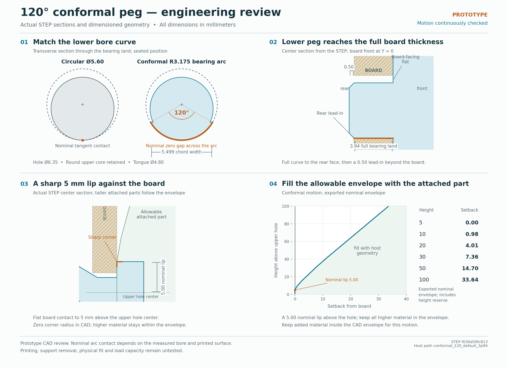
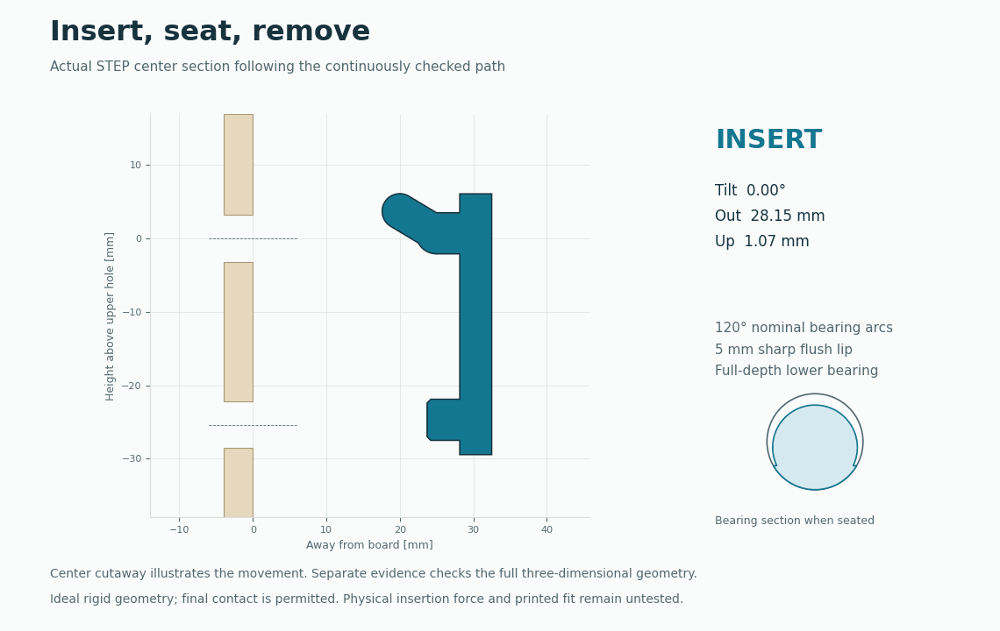
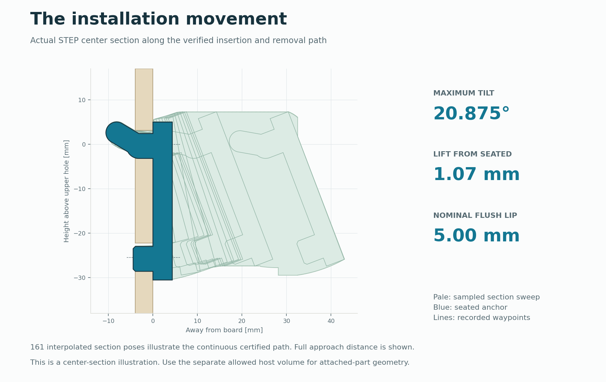

# Conformal bearing and movement study

The current anchor matches the hole's lower curve over **120 degrees**, carries the lower bearing through the full board thickness, and provides a sharp **5 mm nominal flush lip**. Taller attached parts can occupy a CAD envelope derived from the same verified motion.



## Use these files together

| File | Purpose |
|---|---|
| [Conformal peg STEP](cad/conformal/conformal_120.step) | Functional solid in anchor design coordinates |
| [Allowed host volume STEP](cad/conformal/host-envelope/allowed_host_volume.step) | Reference volume for the added part; do not print or fuse this volume |
| [Host interface guide](HOST_INTERFACE.md) | Coordinate system, nominal lip and downstream containment rule |
| [Continuous motion record](cad/conformal/conformal_motion_results.json) | Poses, exact geometry contract, interval certificates and final-contact proof |
| [Independent CAD intersections](cad/conformal/conformal_motion_check.json) | Actual exported STEP sampled along the current path and final seating |
| [Measured bearing faces](cad/conformal/conformal_120_bearing_check.json) | Radius, 120-degree coverage and axial length from STEP faces |
| [CAD and mesh checks](cad/conformal/conformal_120_cad_validation.json) | One valid solid, watertight meshes and actual runtime versions |

The source is [conformal_anchor.py](conformal_anchor.py). Its [bare side](cad/conformal/conformal_120_side_unsupported.stl) and [bare upright](cad/conformal/conformal_120_upright_unsupported.stl) meshes are print-preparation inputs. Supports, slicing and physical fit have not been qualified for this geometry. The [previous round release](ROUND_README.md) retains its own supported 3MF and scaffolds; those supports are shaped for the earlier pegs.

## Resolved dimensions

| Feature | Current default |
|---|---:|
| Board thickness / hole diameter / pitch | 3.94 / 6.35 / 25.4 mm |
| Lower bearing radius / angular coverage | 3.175 mm / 120 degrees, both pegs |
| Upper conformal bearing length | 3.158095 mm |
| Lower conformal bearing length | 3.94 mm, entire board thickness |
| Lower nose beyond the rear face | 0.50 mm axial chamfer |
| Lower projection from the installed board front | 4.44 mm |
| Retained upper circular core / tongue diameter | 5.60 / 4.80 mm |
| Nominal flush lip above upper hole center | 5.00 mm |
| Board-facing corner radius | 0 mm |

Both bearing surfaces are actual cylindrical arcs of the hole's nominal radius, centered on the hole when seated. They are not smaller round rods with cosmetic fillets. Exported STEP measurement gives 120 degrees on each land; the lower nominal mating area is 26.19984 mm2. That area is geometric, not a measured pressure distribution. Exact contact across the arc requires matching the real bore and printed surface.

The upper land stops at the retaining bend. Extending that upper land through the entire board obstructed the tested insertion path. The lower peg's full bearing land reaches the board's rear face before its ordinary 0.50 mm nose begins. The longer lower peg therefore keeps the requested bearing length while retaining a chamfer at its tip.

## Verified movement



The current motion uses **12 waypoints**, reaching **20.875 degrees maximum tilt** and **1.07 mm maximum reference-point lift**. The path needs no additional lift adjustment. Installation and removal traverse the same path in reverse.

The continuous checker covers the actual round core and tongue, the added circular caps, the full-depth lower locator and the sharp front spine. It uses **768 conservative X slabs per half** for the added curved geometry and locator. The **10 free-motion segments receive 168 continuous interval certificates**. Each interval receives a clearance-versus-displacement bound, recursively subdivided where needed. This covers positions between the displayed or sampled poses.

The **single final-contact translation** receives an exact certificate combining circular-core sweeps with full-width circular-cap bounds. In removal order it moves from **Y = -0.15, Z = -0.12 mm** to **Y = -0.12, Z = 0 mm**, at zero rotation. Reversed for installation, it closes the intended bearing and board-face contacts without penetration. The lower nose is conservatively enclosed by the full-radius locator section.

An independent OpenCascade audit intersects the exported STEP with a solid board containing cylindrical holes at **400 current-path poses**, including final seating. The maximum reported intersection volume is **0.0 mm3**. Finite CAD samples supplement the continuous proof.

This establishes **ideal rigid geometry clearance**. The current certificate uses the physical nominal hole with **no additional reserved radial bore clearance**. No printed fit, support-release, load or contact-pressure rating is established. Changed board sizes and arbitrary parameter combinations need new evidence.

## Attached-part envelope



The same motion continuously checks the host envelope. The supplied allowed volume uses the agreed **5.00 mm nominal lip** and a conservative setback boundary above it. Any added host shape can occupy that volume within the export bounds. The pegs themselves are excluded from the host containment rule; the complete attached assembly must follow the same movement.

The mathematical envelope computes the closest permitted host back at every height over every continuously interpolated pose. Its nominal boundary is shifted downward so its flush limit is exactly the 5 mm interface. Joining boundary values with straight chords gives a conservative CAD outline. An independent continuous check confirms that outline stays in front of the board plane. See [HOST_INTERFACE.md](HOST_INTERFACE.md) for the exact flush ceiling and practical containment rule.

## Reproduction

Use an already available compatible CAD runtime or the [repository requirements](requirements.txt). The actual package versions used for the exports are recorded in the CAD validation JSON.

```text
python conformal_anchor.py
python check_conformal_geometry.py
python conformal_motion.py --certify --slabs 768 --max-seconds 180
python verify_conformal.py --candidate-poses 400 --max-seconds 600
python host_envelope.py --motion cad/conformal/conformal_motion_results.json --output cad/conformal/host_envelope.json
python export_host_envelope.py --motion cad/conformal/conformal_motion_results.json --output cad/conformal/host-envelope --nominal-lip 5
python render_conformal.py
python render_conformal_media.py
```

The motion checker reads the current geometry contract and certifies the retained 12-waypoint path against this solid. The independent STEP checker rejects motion records whose geometry or STEP hashes are stale. Preserve exact source hashes with evidence, and regenerate the host envelope and visuals after a motion change.

[DESIGN_HISTORY.md](DESIGN_HISTORY.md) records earlier decisions. The previous round board presets and print preparation remain documented separately in [ROUND_README.md](ROUND_README.md).
