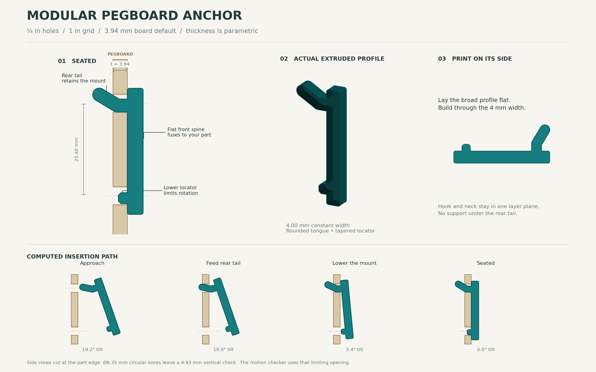

# Modular pegboard anchor

**Print options:** The flat model and the upright model with cut-away webs are documented in [PRINTING_OPTIONS.md](PRINTING_OPTIONS.md). Both orientations are included in `Pegboard_Print_Options.3mf`.

**A reusable FDM anchor for the common US 1/4-inch hook family.** Fuse the flat front spine into your own holder. The upper tongue captures the back of the board; the lower chamfered locator restrains rotation. Print the small single-column anchor first to check your board and printer.

The default is **3.94 mm actual board thickness**, **6.35 mm holes**, and **25.4 mm centers**. Home Depot and Lowe's commonly list nominal 3/16-inch sheet-stock panels at actual 0.155 inch, or 3.937 mm. This supports 3.94 mm as a practical default from their assortment; it does not establish a national sales majority. Actual 0.165 inch / 4.19 mm and true 1/4 inch / 6.35 mm boards also occur. See [research.md](research.md) for product evidence and the 1/8-inch, 3/16-inch, and 1/4-inch nominal families. Lowe's DPI panels can have 9/32-inch holes; use the included measured-hole variant when that matches your board.



## Start here

- **Drop into CAD:** `cad/anchor_default_3p94mm.step`. One valid solid, millimeters, in installed design coordinates.
- **Print a fit sample:** `cad/anchor_default_3p94mm.stl`. Already laid flat on its broad side; do not rotate it upright. The complete anchor is the fit sample.
- **Edit parameters:** `anchor.py` + `motion_design.py` are the canonical procedural CAD source. `pegboard_anchor.scad` provides a self-contained OpenSCAD module. `parameters.json` records the build settings; it is a snapshot, not an automatically loaded configuration file.
- **See movement:** `visuals/insertion-removal.gif`; dimensions in `visuals/anchor-drawing.svg`.
- **Broader mounts:** `cad/two_column_example.step` shows two columns on the 1-inch grid with a front bridge. It is an assembly reference; the complete host controls its print orientation/supports.

STEP imports into Onshape, Fusion, FreeCAD, and other solid modelers. Imported STEP contains solid geometry; the editable parameters live in the procedural sources, not an imported native feature tree.

## Parametric integration

All lengths are millimeters. X runs horizontally across the board; Y points toward the user; Z points up. The board front is Y = 0 and the upper nominal hole center is X = Z = 0. The second hole sits at Z = -25.4. The solid spans X = ±2.00. Its flat fusion face is Y = 4.50. Overlap your host solid with that face by at least 0.3 mm before unioning. Replicate columns horizontally at integer multiples of 25.4 mm; keep both anchors at the same height. Use additional columns when the holder applies appreciable twisting or a long cantilever moment.

```python
from anchor import make_anchor

anchor = make_anchor(board_thickness=3.94, hole_diameter=6.35)
# your_mount is a CadQuery solid that overlaps the anchor's front spine.
result = your_mount.union(anchor)
```

```scad
use <pegboard_anchor.scad>
union() {
    pegboard_anchor(board_thickness=3.94, hole_diameter=6.35);
    // Example host intersects the fusion face at Y=4.5.
    translate([-2,4.2,-25]) cube([4,12,20]);
}
```

Keep new material forward of the spine until you check the entire mount's motion. The installation sweep concerns the supplied anchor; a shelf lip, cup, neighboring tool, wall batten, or a second vertical retaining hook can obstruct an otherwise clear path. Do not scale the whole model to tune fit: edit thickness, hole diameter, and the fit parameters directly.

The design coordinate origin differs slightly from the physical seated pose. The model seats at Y = -front_gap and Z = -seat_drop, establishing contact at the front bearing land and lower edge of the upper bore. Apply this same pose to the host when modeling the installed assembly.

## Insertion and removal

1. Start clear of the board, with the bottom of the mount tipped toward you.
2. Set approximately **19.2°** tilt for the default board, feed the rounded upper tongue through the upper hole, and follow the illustrated small translation as you rotate the body down.
3. Align the lower locator with the hole one row below. Ease the part into its final bearing contacts.
4. To remove, release the bearing contacts, tip and lift along the reverse path, and withdraw the upper tongue. It does not require flexing a printed snap latch.

The default computed path lifts the anchor up to **0.82 mm** above its final bearing position. Its rear swept projection needs **5.55 mm** of unobstructed space behind the board. Provide at least 12 mm for the supplied presets, and more where paint, wall irregularities, or your host requires it. A spacer behind an occupied hole blocks installation even if the rest of the panel has ample standoff.

## Motion study

| Board thickness, mm | Hole diameter, mm | Max tilt | Max lift, mm | Dense checked poses | Continuous sweep |
|---:|---:|---:|---:|---:|---|
| 3.940 | 6.350 | 19.2° | 0.82 | 1,962 | Pass |
| 4.190 | 6.350 | 19.2° | 0.92 | 1,963 | Pass |
| 4.763 | 6.350 | 19.8° | 1.17 | 1,986 | Pass |
| 6.350 | 6.350 | 20.0° | 1.77 | 2,007 | Pass |
| 3.940 | 7.144 | 9.8° | 0.22 | 1,551 | Pass |

We checked the complete upper tongue, spine, and lower locator throughout approach, threading, rotation, seating, and reverse removal. For a constant-width extrusion centered in a circular bore, the restrictive side-view opening is

`effective height = sqrt(hole_diameter² - width²)`

For the default this is **4.932 mm**, rather than the 6.35 mm centerline diameter. This exactly accounts for the model's full width under the specified planar motion. It avoids the common error of checking an infinitesimally thin side view against the full hole diameter.

The search uses translation and rotation about X. Dense verification limits maximum point movement to 0.025 mm between sampled poses. The continuous checker also bounds all intermediate rigid-body positions between poses using midpoint distance and a maximum displacement bound; it recursively subdivides until it proves separation. The final pure-translation seating segment uses an exact polygon sweep and permits intended zero-clearance bearing contact. Reversing a proven path traverses the same swept volume. The algorithm proves a feasible path; it does not claim a globally minimum angle or unique human hand motion.

`motion_results.json` contains the poses, dimensions, certificates, contact results, and assumptions for every preset. `occ_motion_check.json` adds an independent 3D OpenCascade interference check against circular holes for the default anchor and two-column example. This additional check samples poses; the continuous proof comes from the constant-width geometry method above.

## Holding and strength

The 4.0 × 3.6 mm neck has a **14.40 mm² area** and **8.64 mm³ section modulus** for bending in the side-profile plane. Those are geometric properties, not an allowable load. The shallow rounded tongue avoids a small sharp 90° elbow, and its constant width allows each printed layer to contain the full bent load path. A short lead-in locator permits the last stage of insertion.

At the ideal seated pose, the model permits **0.470 mm** straight outward travel before the retaining tongue stops it, **0.282 mm** straight lift before contact, and about **0.687°** outward rocking around the lower bearing land. These are separate imposed-motion bounds, not simultaneous clearances or an equilibrium prediction. Downward loading establishes bearing; this is a removable gravity-retained anchor, with no positive snap lock. Use the measured bore and fit adjustment to control play. Large or worn holes can increase movement.

Start with dry unfilled PETG, a 0.4 mm nozzle, 0.16–0.20 mm layers, and five perimeters. Check that the neck and tongue slice effectively solid. Print the single-column STLs with the complete side profile on the bed: layer stacking follows the 4 mm width, keeping the main bending load within the layer plane. Supports are unnecessary for that isolated orientation. Tune elephant-foot compensation and remove burrs; a swollen first layer can consume the fit allowance. The host may require a different print strategy. Two separate side-printed anchors can also attach to a larger host designed for that purpose.

No physical fit test, load test, fatigue/creep test, or FEA has been performed. Board edge crushing and breakout, printed material/process quality, host lever arm, and load duration can govern capacity. Establish a working load using your actual printer, filament, board, and representative mount.

## Rebuild

```bash
python -m pip install -r requirements.txt
python motion_design.py
python anchor.py
python write_scad.py
python verify_cad.py
python render_study.py
python write_reference_readme.py
```

To generate a custom CAD export:

```bash
python anchor.py --thickness 4.2 --hole-diameter 7.1
```

This command rebuilds geometry only. Recheck motion after custom dimensions or host changes:

```python
from motion_design import Study
result = Study({"board_thickness":4.2, "hole_diameter":7.1}).build("my_board")
assert result["verification"]["passed"]
```

## Parameters

| Parameter | Build value, mm unless noted |
|---|---:|
| `board_thickness` | 3.94 |
| `hole_diameter` | 6.35 |
| `pitch` | 25.4 |
| `width` | 4.0 |
| `neck_height` | 3.6 |
| `spine_depth` | 4.5 |
| `spine_height` | 34.6 |
| `pull_clearance` | 0.47 |
| `elbow_offset` | None |
| `tongue_run` | 5.0 |
| `tongue_rise` | 3.0 |
| `locator_depth` | 2.3 |
| `locator_height` | 3.0 |
| `hole_clearance` | 0.1 |
| `front_gap` | 0.15 |
| `seat_drop` | 0.12 |

`pull_clearance` sets the target straight outward play at the seated pose. Keep `elbow_offset=None` in Python (`undef` in OpenSCAD) for automatic fitting as hole diameter or thickness changes. A numeric elbow offset overrides that calculation. The signed offset describes the bend location, not a physical gap.

`hole_clearance` is the search allowance subtracted from each side of the effective vertical bore opening; it does not enlarge or shrink the printed model. `front_gap` and `seat_drop` describe the small final seating movement. Other dimensions drive geometry directly. OpenSCAD uses smooth tessellation with 96 facets per circle; the canonical CAD uses the documented polygonal roundovers from `motion_design.py`, so edge tessellation is slightly different. OpenSCAD source syntax was inspected; no OpenSCAD compiler was available for this build.
