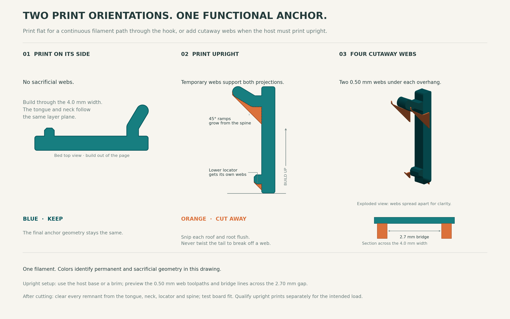

# Two print orientations

The anchor now has an optional set of cut-away webs for printing upright as part of a larger holder. The finished pegboard interface remains the same after you trim the webs flush.

| Option | Use | Preparation |
|---|---|---|
| **Flat on its side** | Isolated anchors and holders that can share that orientation | Print the existing flat STL. Automatic supports off. |
| **Upright with cut-away webs** | Holders that stand on the bed with the pegboard face vertical | Print the supported STL, or fuse the supported CAD into your holder. Snip all four webs off afterward. |

`Pegboard_Print_Options.3mf` contains both options, separated on the bed. It is a standard geometry-only 3MF: choose your printer and filament, then slice the option you want. It does not contain machine-specific settings or G-code.



## The sacrificial webs

Two **0.50 mm** membranes sit beneath each projection: four membranes total. Their lower edges grow rearward at **45°**, beginning on the existing spine. Each membrane sits **0.15 mm inside** the outer face, preserving the outer bearing corners. The gap between the paired membranes is **2.70 mm** across the anchor width. The material above that gap prints as a short bridge.

The default four webs add approximately **22.6 mm³** of plastic, about 3% of the bare anchor volume. They are thin cutting targets; they are not permanent reinforcing gussets. The upper and lower supports follow their respective undersides, including the rounded rear tip.

Print the anchor and webs together in one material. The orange color in the illustration and reference STEP identifies material to remove; it does not require a second filament.

## Starting print setup

- 0.4 mm nozzle and 0.20 mm layers. Use five walls for the flat version.
- For the upright anchors, use a local modifier with **two walls and 100% infill**. This leaves room for roof skin to bridge across the supporting webs. The rest of a larger holder can keep its own wall settings. Inspect the neck to confirm it slices solid.
- Use a calibrated filament profile. PETG is a starting material choice; the model does not require a special support filament.
- For the isolated upright coupon, use a **6 mm brim**. The finished holder may already provide enough bed contact.
- Turn automatic supports off for the isolated coupons. A larger host can need its own supports.
- Confirm that the preview includes all four thin webs. Their nominal 0.50 mm thickness should produce a continuous extrusion with an appropriate thin-wall/variable-width configuration.
- The first roof spans **across X**, between the webs. Check the bridge direction in the actual slicer you use; generic geometric checks do not establish every slicer's toolpath choices.
- Keep seam buildup away from the surfaces that pass through the pegboard holes. Trim strings and any first-layer swelling before checking the fit.

Prusa's design guidance supports modeled break-away supports, short bridges, sufficient thin-wall thickness, and chamfers at downward-facing edges. It also explains why print orientation affects the finished part. These recommendations guide the geometry; they do not certify this particular print. [Prusa: Modeling with 3D printing in mind](https://help.prusa3d.com/article/modeling-with-3d-printing-in-mind_164135)

## Remove the webs

1. Hold the solid spine. Use small flush cutters to snip each membrane along its attachment to the spine.
2. Snip the membrane's upper attachment along the underside of the hook or locator. Work from the nearest side face.
3. Remove the thin web and pare remaining material flush with the original blue surface shown in the diagram. Preserve the outer bearing corners.
4. Check that both holes accept the part and that the finished tongue seats normally.

Avoid twisting the upper tongue to break off a web. The webs have fused roots and roofs; cut them deliberately rather than relying on an uncontrolled brittle fracture. They must come off before installing the anchor.

## Parametric integration

Use the same dimensions for the supported version and the final anchor:

```python
from print_scaffold import make_printable_upright

anchor_and_webs = make_printable_upright(board_thickness=3.94,
                                        hole_diameter=6.35)
result = your_holder.union(anchor_and_webs)
```

The common design coordinates remain X across the board, Y toward the user, and Z up. Fuse your holder to the front spine at Y=4.5 mm. `cad/anchor_upright_supported.step` keeps those coordinates; the STL shifts the same solid onto Z=0 for printing.

`cad/upright_cutaway_reference.step` separates the blue retained body and orange sacrificial webs for inspection. The fused supported STEP/STL is the printable model.

## What we verified

- Supported CAD is one valid solid; the STL is watertight.
- All five board/hole presets pass geometric web-growth checks at 0.20 mm layers and four layer phases.
- Each ramp grows rearward by at most one layer height per layer, corresponding to 45°.
- The original motion study remains applicable to the original interface after complete, flush removal of the sacrificial material.
- CuraEngine 5.0.0 sliced both orientations with automatic supports off. Its actual upright toolpaths preserve all four 0.50 mm webs and create roof skin across X with the local settings above. See `SLICER_CHECK.md` and `slicer_check.json` for the complete generic test setup, bridge settings, and limits. A Bambu Studio or OrcaSlicer preview still needs its own check; generic Cura toolpaths do not certify a printer profile.

The upright version has a different layer orientation. Its supports solve deposition beneath the projections; they do not give it the same layer load path as the flat version. Use a physical print and representative load test to compare the two orientations. Neither version has a load rating.

Rebuild the upright CAD with `python print_scaffold.py`; rebuild the two-option 3MF with `python write_print_3mf.py`.
