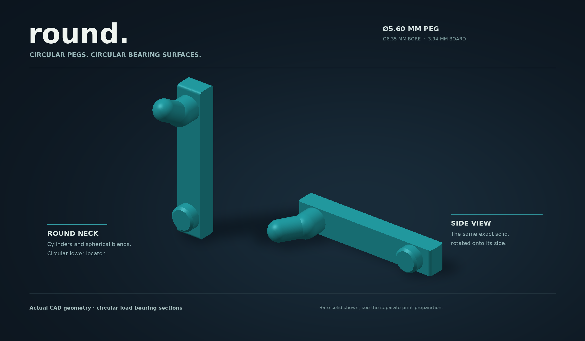
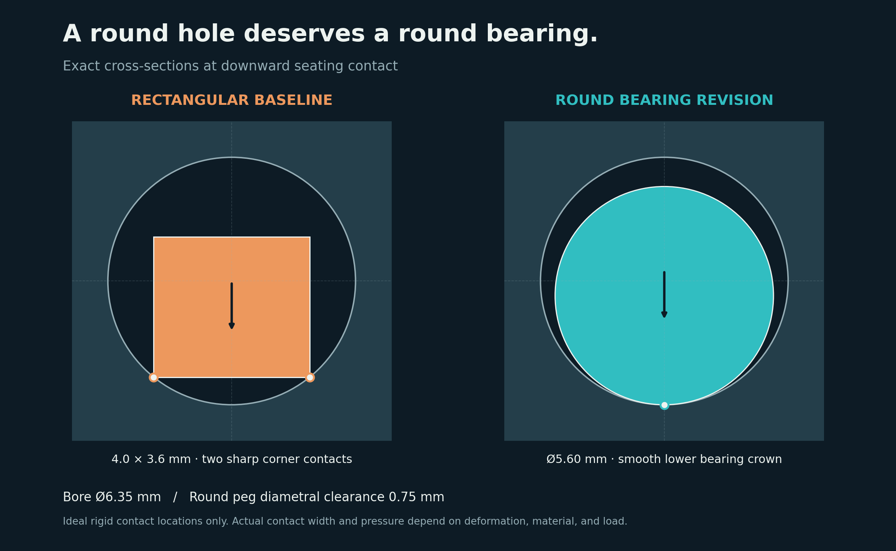
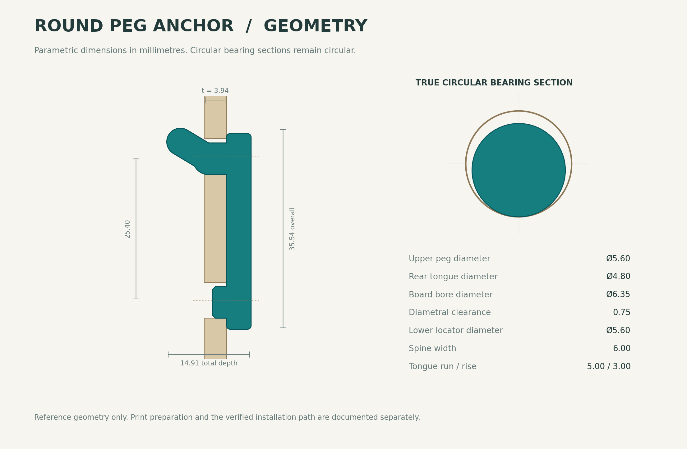
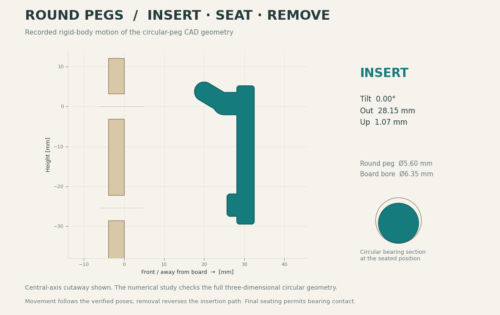
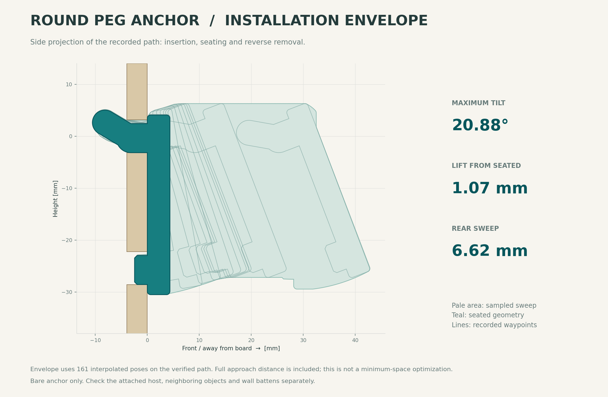
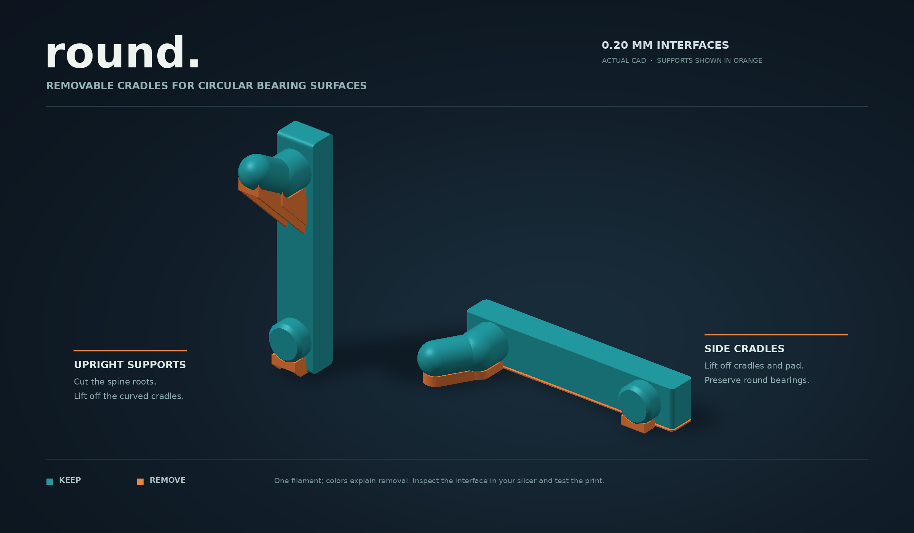

# Round pegboard anchor

A modular, parametric FDM attachment for **round 1/4-inch pegboard holes on a 1-inch grid**. The current design uses **5.6 mm circular bearing pegs and a 4.8 mm circular retaining tongue**. Fuse the front spine into a tool holder, bin, bracket, or other mount.



**Start with [Round_Print_Options.3mf](Round_Print_Options.3mf?raw=1).** It contains the current side and upright models with removable printing cradles. Select your own printer and filament profile, keep each anchor and its supports in their supplied relative positions, and print one fit sample first. Do not independently drop the side model’s disconnected shells to the bed: its functional anchor is deliberately lifted 0.40 mm above the support bed. This is a geometry-only project, with no printer profile or G-code.

## Current files

| Use | Download | Contents |
|---|---|---|
| Compare both print orientations | [Round_Print_Options.3mf](Round_Print_Options.3mf?raw=1) | Two printable options with their cradles |
| Print on the side | [Side STL with cradles](cad/round_side_supported.stl?raw=1) | Round anchor plus removable support geometry |
| Print upright | [Upright STL with cradles](cad/round_upright_supported.stl?raw=1) | Cradles carried by sacrificial ramp webs |
| Integrate into CAD | [Functional STEP](cad/round.step?raw=1) | Finished round anchor in design coordinates |
| Add upright supports to a host | [Upright supported STEP](cad/round_upright_supported.step?raw=1) | Functional anchor and printing scaffold |
| Inspect support removal | [Upright color reference](cad/round_upright_support_reference.step?raw=1) | Retained and removable geometry distinguished |
| Use your own support strategy | [Bare side STL](cad/round_side_unsupported.stl?raw=1), [bare upright STL](cad/round_upright_unsupported.stl?raw=1) | Functional geometry; provide appropriate supports |

The current files are the **round** version. The earlier rectangular model, its source, and its evidence remain available through the [baseline documentation](BASELINE_README.md) and git history. Its support-free side-print claim and motion results belong to that earlier geometry.

## Why the pegs are round

The rectangular baseline touched the lower outside edges of a round bore at two sharp corners. This revision gives both pegs true circular sections and a smooth lower bearing crown. It also uses a rounded retaining tongue and a chamfered circular lower locator to help insertion.



The **5.6 mm neck / 4.8 mm tongue** combination is deliberate. A uniformly fat retaining hook became harder to thread through the board. Reducing only the retaining tongue preserves a larger bearing section in the hole while making the installation motion possible. A 5.8 mm neck with a 4.0 mm tongue also found a path, but that thinner tongue had a smaller bending section modulus than the original rectangular neck; it was not selected.

Round surfaces remove the sharp corner contacts. They do not create an interference fit or establish a load rating. Ideal rigid contact is a tangent line along the cylindrical bearing land; actual contact width and pressure depend on deformation, material, and load.

## Default dimensions and US board thicknesses

| Parameter | Default |
|---|---:|
| Actual board thickness | **3.94 mm** |
| Minimum design hole diameter | **6.35 mm / 1/4 inch** |
| Hole pitch | **25.4 mm / 1 inch** |
| Upper bearing peg diameter | **5.60 mm** |
| Lower locator diameter | **5.60 mm** |
| Retaining tongue diameter | **4.80 mm** |
| Diametral bore clearance | **0.75 mm** |
| Front spine width | **6.00 mm** |
| Tongue centerline run / rise | **5.00 / 3.00 mm** |
| Lower locator projection / nose chamfer | **2.30 / 0.50 mm** |



US home-center hardboard commonly appears in the nominal **3/16-inch** and **1/4-inch** families, with thinner 1/8-inch stock also sold. Nominal thickness is not always actual thickness. The research found common thin home-center products around **0.155 inch = 3.937 mm** and **0.165 inch = 4.191 mm**. The 3.94 mm release default is a practical choice based on that retail evidence; no national sales dataset establishes an exact majority or statistical mode. See [the product research and primary source links](research.md).

Some Lowe's/DPI panels specify **9/32-inch holes**, rather than exactly 1/4 inch. Measure thickness and several holes separately. Paint, wear, swelling, and manufacturing variation can change fit.

### Continuously checked round presets

| Actual thickness | Hole diameter | Bearing peg diameter | Tongue diameter | Maximum tilt | Maximum lift |
|---:|---:|---:|---:|---:|---:|
| **3.94 mm** | **6.35 mm** | **5.6 mm** | **4.8 mm** | **20.875°** | **1.070 mm** |
| 4.19 mm | 6.35 mm | 5.6 mm | 4.8 mm | 20.875° | 1.170 mm |
| 4.7625 mm, true 3/16 inch | 6.35 mm | 5.4 mm | 4.8 mm | 20.375° | 1.320 mm |
| 6.35 mm, true 1/4 inch | 6.35 mm | 5.2 mm | 4.8 mm | 19.750° | 1.795 mm |
| 3.94 mm | 7.14375 mm, 9/32 inch | 5.6 mm | 4.8 mm | 13.000° | 0.395 mm |

**Thickness is tunable, but diameter must follow the tested combination.** The bounded search did not find a valid path for the default 5.6 mm neck through the two thicker 6.35 mm-hole cases. Those presets use smaller round pegs. Do not simply stretch the neck through a thicker board and assume the installation path remains valid. Arbitrary parameter combinations require a new motion check. The full parameter sets and evidence are in [round_motion_presets.json](round_motion_presets.json). Preset STEP files are available for [4.19 mm stock](cad/round_stock_4p19.step?raw=1), [true 3/16-inch stock](cad/round_nominal_3_16.step?raw=1), [true 1/4-inch stock](cad/round_true_1_4.step?raw=1), and [9/32-inch holes](cad/round_9_32_holes.step?raw=1). Corresponding bare side/upright STLs live in `cad/`; generate and check suitable supports for those variants. The packaged supported 3MF is the 3.94 mm default.

## Insertion, removal, and holding at rest



Thread the upper tongue while tilted, rotate the mount down as the lower locator approaches its hole, then settle the round pegs and front bearing face. To remove it, unload it, release the seated contacts, tip and lift along the reverse path, and withdraw the tongue.

| Default result | Value |
|---|---:|
| Maximum installation tilt | 20.875° |
| Maximum lift above the seated pose | 1.07 mm |
| Rear swept projection behind the board | 6.62 mm |
| Straight outward travel before retaining contact | 0.470 mm |
| Straight upward travel before contact | 0.282 mm |
| Outward rocking to the modeled rear stop | About 0.675° |

The clearance allows installation; the retaining tongue, circular bore bearing, lower locator, and front face control the seated position. The listed travel values are geometric motion limits under specified movements, not measured rattle or removal force.



The [full motion study](ROUND_MOTION_STUDY.md) and [default JSON evidence](round_motion_results.json) include the exact poses, assumptions, and certificates. The upper hook is a union of circular capsules centered in the symmetry plane. Its collision check reduces exactly to that plane, then uses circumscribed polygon bounds. The lower circular locator is conservatively enclosed in 96 X slabs per half, with the most restrictive bore section for each slab. Rotation about X preserves those slabs.

Every accepted free-motion segment receives a continuous distance-versus-motion bound, including rotation. The continuous check reserves **0.10 mm radial bore clearance**. The last seating movement receives a separate exact contact certificate, allowing the intended zero-gap contacts. A shortcut that passed sampled checks failed the continuous test and was refined before release. The default dense audit also checks 2,038 frames. The animation uses the certified pose sequence; it is not an invented installation sketch.

An independent OpenCascade check of the actual STEP also found zero overlap in [80 single-anchor poses](round_occ_motion_check.json) and [80 poses of the supplied two-column example](round_pair_occ_motion_check.json), including seating. A separate check confirms contact at the predicted rocking stop and interference just beyond it. The continuous proof covers ideal rigid geometry, the board, and the functional anchor. Remove every printing scaffold before installation. Your complete holder, nearby hooks, backing wall, and hands need their own clearance assessment.

## Printing the round geometry



Circular pegs change the printing problem. Their lower quadrants no longer have the broad flat underside of the old rectangular extrusion. The supplied models retain the circular bearing shape and add removable cradles around it.

| Orientation | Preparation | Removal |
|---|---|---|
| Side | Supplied cradles support the side-facing hemisphere and the smaller tongue | Remove the cradles and inspect the circular surface; keep their internal positions during slicing |
| Upright | Cradles sit on thin ramp webs rooted into the front spine | Snip the sacrificial web roots, remove the cradles, and trim the attachment remnants |

The side arrangement includes a **0.40 mm functional lift and a 0.20 mm sacrificial spine pad** so a real support interface can fit beneath the rods. Remove that pad with the cradles. The cradle interface uses a **0.20 mm vertical gap**. That is a modeled support gap, not a guaranteed physical removal tolerance. The side arrangement puts support contacts away from the installed lower bearing crown. The upright arrangement supports the earliest central underside of the circular geometry; the old pair of edge webs was insufficient by itself.

Use the supplied generic slicing evidence as a starting point, then select your actual machine and filament profile. Inspect the first appearance of each rod, support interfaces, narrow webs, and bridge directions. The side orientation generally preserves the more favorable hook bending load path. Upright supports solve deposition geometry; they do not make upright interlayer strength equal to a side print.

The [round slicing report](ROUND_SLICER_CHECK.md), [exact settings and input hashes](round_slicer_check.json), and [portable replay instructions](tools/ROUND_REVIEW.md) record the toolpath evidence and removal details. At 0.20 mm layers, the supported side model has 32 layers and no flagged functional perimeter portions. The supported upright model has 178 layers and a 0.051 mm fringe at an early spine edge; its round rods have no floating starts. These are geometric toolpath checks, not physical print simulations. Generic review G-code is deliberately excluded from the repository.

## Strength: what changed, and what is still unknown

| Section | Area | Elastic bending section modulus |
|---|---:|---:|
| Earlier 4.0 × 3.6 mm rectangular neck | 14.40 mm² | 8.64 mm³ |
| Current 5.6 mm circular bearing neck | 24.63 mm² | 17.24 mm³ |
| Current 4.8 mm circular tongue | 18.10 mm² | 10.86 mm³ |

Both circular sections exceed the earlier neck's geometric section modulus. These are section properties, not allowable loads. The tongue junction, host lever arm, material, layer direction, creep, and hardboard crushing or breakout can still govern failure. No physical fit, load, fatigue, creep, or contact-pressure test has established a rating.

Print one fit sample, inspect the bearing surfaces after support removal, and try it on the actual board. Then test the intended holder and lever arm progressively. Do not use a forceful insertion as a substitute for correcting an unsuitable parameter combination.

## Modular CAD interface

All dimensions are millimeters. **X** runs horizontally across the board, **Y** points toward the user, and **Z** points upward. The board front is **Y = 0**, the rear is **Y = -board_thickness**, and the hole centers are at **Z = 0** and **Z = -25.4**.

The front fusion face is **Y = 4.5 mm**. Overlap a host by at least about 0.3 mm so the Boolean union has real shared volume. Replicate columns horizontally at whole multiples of 25.4 mm. The `round_pair()` helper and [two-column example STEP](cad/round_two_column_example.step?raw=1) demonstrate a front bridge fused to two anchors. A second vertically displaced retaining hook is not automatically compatible with this threading motion.

The physical seated transform is **Y = -0.15 mm, Z = -0.12 mm, rotation = 0°**. The convenient design origin is slightly above and in front of that position. Apply the same transform to the complete attached holder when inspecting the installed assembly.

```python
import cadquery as cq
from round_anchor import make_round_anchor

# Common thin US hardboard default.
anchor = make_round_anchor()

# Tested true-quarter-inch-thick board combination.
thick_board_anchor = make_round_anchor(
    board_thickness=6.35,
    peg_diameter=5.2,
    tongue_diameter=4.8,
)
cq.exporters.export(thick_board_anchor, "my_round_anchor.step")
```

`peg_diameter`, `tongue_diameter`, `locator_diameter`, `board_thickness`, `hole_diameter`, and `pitch` are independent parameters. `diametral_clearance` can derive the main peg diameter from the hole diameter. The rear elbow position is derived when `elbow_offset=None`; preserve that relationship unless you deliberately repeat the motion study.

STEP provides portable solid geometry. [round_anchor.py](round_anchor.py) supplies procedural parameters; STEP does not carry an editable native Onshape/Fusion feature history. [round_print_supports.py](round_print_supports.py) generates the optional printing scaffold. [write_round_3mf.py](write_round_3mf.py) packages the two print options without machine settings.

## Reproduce and continue

Install the [Python dependencies](requirements.txt), use the canonical source files, and keep geometry, motion evidence, print preparation, and visuals together. The current rebuild commands and file ownership are in [HANDOFF.md](HANDOFF.md). The generic Cura replay and path-analysis tools are documented in [tools/ROUND_REVIEW.md](tools/ROUND_REVIEW.md).

The repository retains the [design history](DESIGN_HISTORY.md), [retail research](research.md), [rectangular baseline](BASELINE_README.md), and current numerical evidence. The next useful work is a physical fit and support-removal trial on the intended printer and board, followed by a representative holder test. Further changes should address an observed weakness and receive the relevant geometry, motion, and printing checks.
