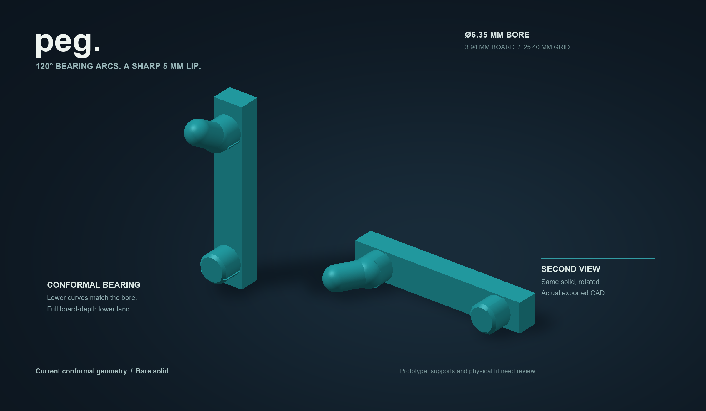
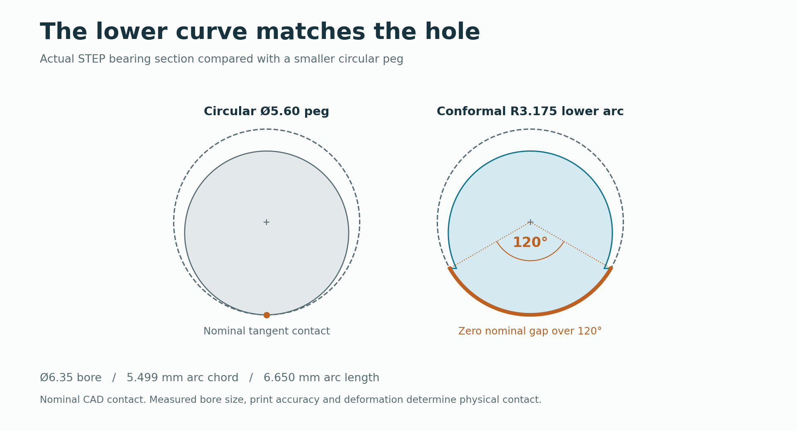
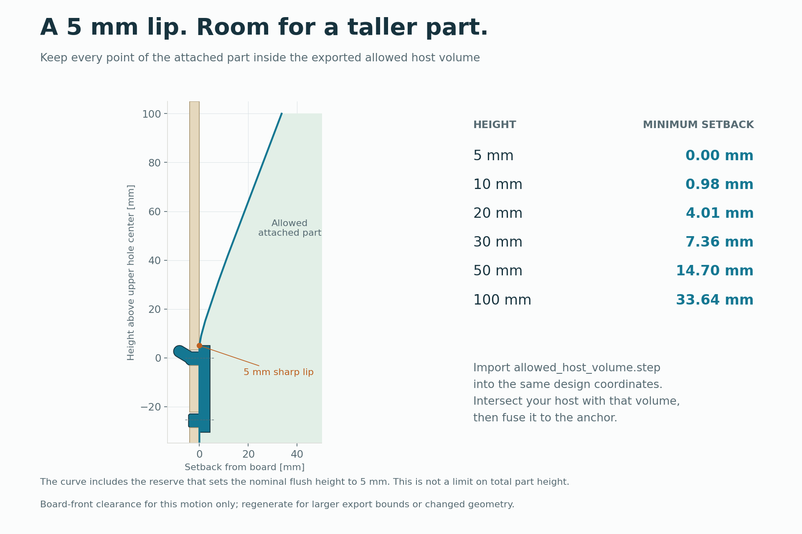

# Conformal pegboard anchor

A reusable rear attachment for holders, bins and brackets on **6.35 mm (1/4-inch) holes at 25.4 mm (1-inch) pitch**. Both pegs match the bore's lower curve over **120 degrees**. The lower peg bears through the full **3.94 mm board thickness**. A sharp **5 mm nominal lip above the upper hole center** sits flush against the board; taller attached parts can take any shape inside the supplied movement envelope.



**Start with the [functional STEP](cad/conformal/conformal_120.step?raw=1) and [allowed host volume STEP](cad/conformal/host-envelope/allowed_host_volume.step?raw=1).** Import them together to build an attached part. The current geometry has its own continuous movement verification and independent solid-model checks. Its bare meshes are inputs for print preparation; supports, slicing and physical fit still need qualification.

## Current downloads

| Use | File | Contents |
|---|---|---|
| Integrate the attachment into CAD | [Functional STEP](cad/conformal/conformal_120.step?raw=1) | One solid in anchor design coordinates |
| Define the attached part's permitted shape | [Allowed host volume STEP](cad/conformal/host-envelope/allowed_host_volume.step?raw=1) | Reference volume derived from this anchor's movement; do not print or fuse the volume |
| Prepare a side print | [Bare side STL](cad/conformal/conformal_120_side_unsupported.stl?raw=1) | Functional geometry in side orientation; needs a checked support strategy |
| Prepare an upright print | [Bare upright STL](cad/conformal/conformal_120_upright_unsupported.stl?raw=1) | Functional geometry in upright orientation; needs a checked support strategy |
| Inspect without reorientation | [Design-coordinate STL](cad/conformal/conformal_120_design_unsupported.stl?raw=1) | Mesh aligned with the STEP and host envelope |
| Change procedural dimensions | [conformal_anchor.py](conformal_anchor.py) | CadQuery source, geometry contract and exporters |

## Bearing geometry



Each peg has an actual **3.175 mm-radius cylindrical arc** along its bottom. When seated in the nominal bore, the curved bearing surfaces coincide over 120 degrees. The upper circular core and smaller retaining tongue provide the threading geometry.

| Feature | Current default |
|---|---:|
| Actual board thickness / hole diameter / pitch | **3.94 / 6.35 / 25.4 mm** |
| Conformal bearing radius / arc coverage | **3.175 mm / 120 degrees** on both pegs |
| Upper conformal bearing length | **3.158095 mm** |
| Lower conformal bearing length | **3.94 mm**, full board thickness |
| Lower nose beyond the rear board face | **0.50 mm** axial chamfer |
| Lower total projection from the installed board front | **4.44 mm** |
| Upper circular core / retaining tongue diameter | **5.60 / 4.80 mm** |
| Front spine width / design-coordinate fusion face | **6.00 mm / Y = 4.50 mm** |
| Nominal flush lip above the upper hole center | **5.00 mm** |
| Board-facing corner radius | **0 mm**, sharp planar seam |


The upper conformal land stops at the retaining bend to permit the verified insertion. The lower peg spans the whole board: its 0.50 mm nose begins beyond the rear face, after the full bearing land.

The lower land's nominal mating area is **26.20 mm2**. This is geometric area, not measured contact pressure or a load rating. Exact full-arc contact depends on the real bore, printed surface and deformation. Measure board thickness and several holes before preparing a fit sample. Other board sizes require their own geometry and movement checks.

## Integrate with custom parts and models

The 5 mm dimension is measured **above the upper hole center**, not above the peg's crown and not from the bottom of the holder. It defines the nominal maximum height of a board-flush rear face. Above it, move the back of the attached part forward according to the allowed volume. A tall tool holder can use a step, slope, ribs or any other shape that fits.



Import the two STEP files in the same coordinates. Create the added host entirely inside the allowed volume, then fuse it into the anchor's front spine with real shared volume. Include all added ribs and fasteners in the containment check. The anchor's own pegs intentionally lie outside the host envelope.

The supplied reference volume spans **X = -50 to +50 mm**, installed height **-80 to +100 mm**, and front projection **60 mm**. These are export bounds, not a limit on the mathematical interface; the generator accepts larger bounds. The envelope checks the complete board front throughout the same movement as the peg. It does not account for neighboring holders, rear walls or hand access.

All dimensions are millimeters. **X** runs across the board, **Y** points toward the user, and **Z** points up. The board front is **Y = 0**; its hole centers are **Z = 0 and -25.4 mm**. In the supplied CAD, the spine's front fusion face is **Y = 4.50 mm**, the board-facing back is **Y = 0.15 mm**, and the nominal lip is **Z = 5.12 mm**. The seated assembly translates **Y = -0.15 mm, Z = -0.12 mm**, with zero rotation.

In Fusion, Onshape or another solid modeler:

1. Import the functional STEP and allowed-volume STEP without moving either independently.
2. Model the added part inside the allowed volume. Above the 5 mm lip, follow the rear setback boundary. Extend the part into the spine's front face with real overlap; 0.3 mm is a useful Boolean construction starting point.
3. Check that subtracting the allowed volume from the added part leaves no material, then union the host and functional anchor. Keep the reference envelope out of the finished model.
4. Inspect the complete assembly along the supplied motion and confirm clearance from nearby objects. Use the seated transform when checking its final position on the board.

For procedural CAD, this complete example clips a tall host blank to the allowed volume and fuses it to the default anchor:

```python
import cadquery as cq
from conformal_anchor import make_conformal_anchor

anchor, geometry = make_conformal_anchor()
allowed = cq.importers.importStep(
    'cad/conformal/host-envelope/allowed_host_volume.step'
)
# 24 mm wide, 24 mm deep, 65 mm tall; starts at design Y = 4.2 mm.
blank = cq.Workplane('XY').box(24, 24, 65).translate((0, 16.2, 2.5))
host = blank.intersect(allowed)

outside = host.cut(allowed)
assert sum(s.Volume() for s in outside.solids().vals()) < 1e-6
assembly = anchor.union(host)
assert assembly.val().isValid() and len(assembly.val().Solids()) == 1
cq.exporters.export(assembly, 'my_holder.step')
```

Replace the blank with your own model, using the envelope to check or shape its back. To change peg dimensions, pass a parameter dictionary such as `make_conformal_anchor(overrides={'board_thickness': 4.19})`; regenerate and verify that geometry's movement and host envelope before using it. The supplied certificates cover the default dimensions only.

See [HOST_INTERFACE.md](HOST_INTERFACE.md) for the exact movement-dependent height ceiling, containment rule and regeneration options.

## Installation and removal


Thread the upper tongue while tilted, rotate the holder toward the board as the lower peg enters its hole, then close the intended bearing contacts. Removal reverses the same path. The maximum installation tilt is **20.875 degrees** and the reference-point lift is **1.07 mm**.


The [movement study](CONFORMAL_STUDY.md) certifies **12 waypoints** with **168 continuous interval certificates across 10 free-motion segments**, plus **one exact final-contact translation**. The bounds use 768 X slabs per half for the curved additions. An independent OpenCascade audit of the exported solid found **zero overlap at 400 path poses**, including seating. The animation follows the certified pose sequence.

The current proof uses the **physical nominal bore** and permits the intended seated contacts. It reserves no additional radial bore clearance. The result establishes ideal rigid geometry clearance; actual printed fit and insertion feel need a physical sample. No load, fatigue, creep or support-release rating has been established.

## Print preparation

The current side and upright STLs contain **only the functional anchor**. Build and check supports for the selected orientation and the complete attached holder. The projecting tongue and full-depth lower peg need a support strategy that preserves their functional surfaces.

Use the intended printer and filament profile, inspect the first appearance of each projection and the bearing surfaces, then print one fit sample. Preserve the 120-degree bearing curves and sharp board-facing seam when removing supports. Fit trials and a representative holder test are the next qualification steps.

## Sources and evidence

| Record | What it establishes |
|---|---|
| [Resolved geometry](cad/conformal/conformal_120_geometry.json) | Dimensions and exact construction used by the CAD and motion checker |
| [Exported bearing-face check](cad/conformal/conformal_120_bearing_check.json) | Measured radius, 120-degree coverage and bearing lengths from STEP |
| [Solid and mesh validation](cad/conformal/conformal_120_cad_validation.json) | One valid solid and watertight, positive-volume meshes |
| [Continuous motion](cad/conformal/conformal_motion_results.json) | Input hashes, poses, interval certificates and final-contact proof |
| [Independent STEP intersections](cad/conformal/conformal_motion_check.json) | Sampled solid-model interference checks |
| [Allowed-volume certificate](cad/conformal/host-envelope/allowed_host_volume.json) | Host boundary, export bounds and continuous board-front clearance |

Use the [Python requirements](requirements.txt) or an already available compatible CAD runtime; the validation record identifies the versions actually used. Rebuild the current geometry and its dependent evidence in this order:

```text
python conformal_anchor.py
python check_conformal_geometry.py
python conformal_motion.py --certify --slabs 768 --max-seconds 180
python verify_conformal.py --candidate-poses 400 --max-seconds 600
python host_envelope.py --motion cad/conformal/conformal_motion_results.json --output cad/conformal/host_envelope.json
python export_host_envelope.py --motion cad/conformal/conformal_motion_results.json --output cad/conformal/host-envelope --nominal-lip 5
python render_conformal.py
python render_conformal_media.py
```

[HANDOFF.md](HANDOFF.md) records source ownership and publication checks. [research.md](research.md) records the board-size research.

## Graveyard

[Previous round release and its supported 3MF](ROUND_README.md) / [rectangular baseline](BASELINE_README.md) / [design history](DESIGN_HISTORY.md). Their CAD, supports and evidence belong to those older shapes.
