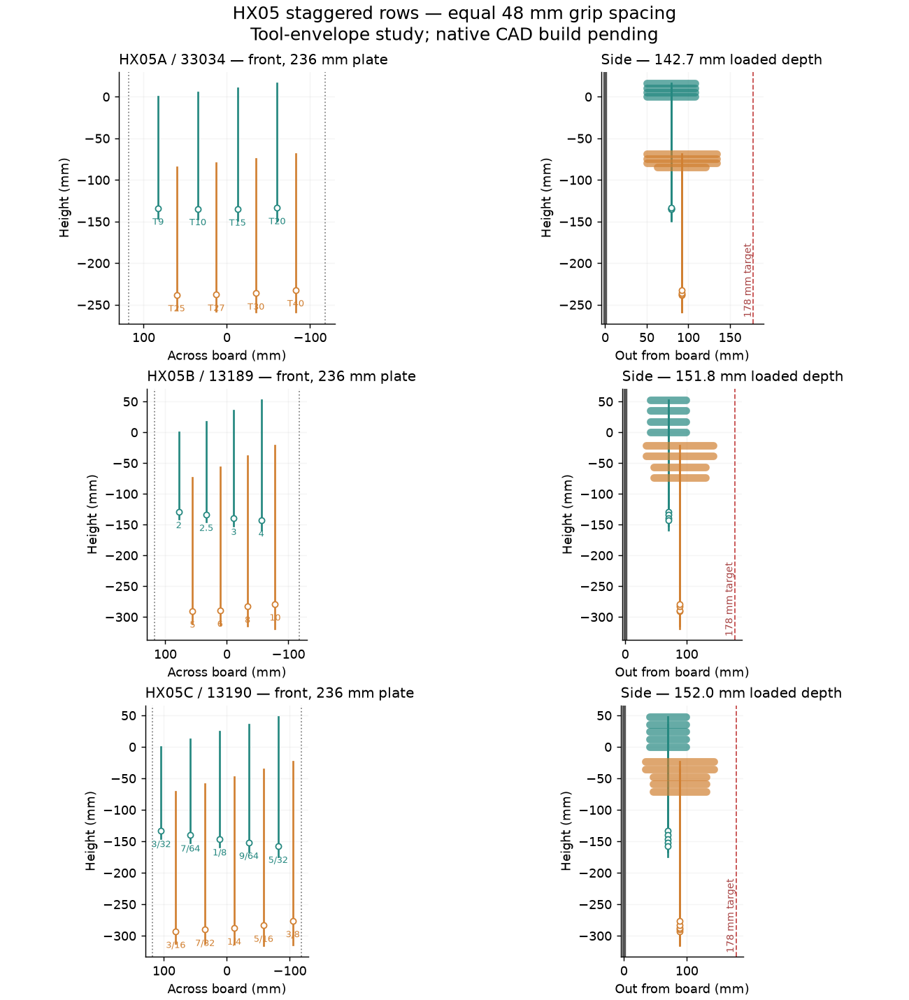

# HX05 Bondhus single-set racks — source and build handoff

Branch `hx05`. The reconciliation with dev-box `7d7b2fc` is complete: that commit was already published and inherited through HX04 v2. See [RECONCILIATION.md](../key_fan_v1/hx05/RECONCILIATION.md).

Three candidates use two staggered, graduated rows with forward-pointing grips: HX05A / 33034 Torx, HX05B / 13189 metric, HX05C / 13190 inch. Each is a single-set rack. The 236 mm mounting plate and full hook / intermediate bearing / bottom-lock grid remain. Grips have equal **48 mm centre spacing within each row**, enlarged from the inherited 39.2 mm to clear neighboring tools throughout the sampled clock play. The gap between rows is set by withdrawal clearance, not counted as another grip pitch. Socket seats are at least 4× across flats for hex and 4× nominal point-to-point for Torx. Bars follow hex corners. Fillaprint labels, brace-type solid zones and left-end printing remain.

The HX05 execution sources are isolated here; the original `key_fan_v1` pipeline is restored byte-for-byte to published HX04 v2 so its evidence hashes continue to match. The added row mode is opt-in (`SHORT_TONLY=1 SHORT_TEE_STAND=1`). Each row gets its own rail and socket braces; joining all sockets into one convex rail would fill the space between tiers. The unchanged HX04 layout is regression-checked against the study source at `c108ee4` (default HX04 behavior). Shared peg geometry is untouched.

| Rack | Set | Reported inherited depth | New dense sampled depth | Plate height study |
|---|---|---:|---:|---:|
| HX05A | 33034 | ~246 mm | 142.7 mm | 162.4 mm |
| HX05B | 13189 | ~285 mm | 151.8 mm | 227.2 mm |
| HX05C | 13190 | ~507 mm | 152.0 mm | 219.3 mm |

Inherited depths are the handoff figures, using its old estimates; they were not rerun as native CAD. New depths include tools at the sampled rotation limits. Plate heights are numerical bounds from the build formula, not exported meshes.



## Layout evidence and limits

Selected layouts are `study/hx05a_stand.json`, `hx05b_stand.json`, `hx05c_stand.json`. Each records its source hashes, exact build environment, parameters, planned lift distances and search results. Corresponding `*_layout-check.json` files recheck the same **fixed lift-then-forward route** at nominal, both clock-play limits and alternating neighbor limits, using 0.75 mm tool points/lift samples and 1.25 mm forward samples.

These are dense sampled layout checks of sphere/capsule tool envelopes and convex rail planes. They are not continuous motion certificates, actual FreeCAD solids, qualified print files or physical fit/load evidence. The shared study's approximate own-bore exclusion is still used; native checking is required for both rails, labels, floors, braces, pegs and withdrawal paths. Hand clearance is not physically qualified by equal centre spacing.

`study/tee_sets_note.json` identifies the [Bondhus 2023 catalogue](https://3989ac5bcbe1edfc864a-0a7f10f87519dba22d2dbc6233a731e5.ssl.cf2.rackcdn.com/bondhus42/catalogs/2023/2023_US_Bondhus_Catalog_A.pdf), printed pages 35 and 41. All three sets now use its millimetre overall and bar lengths rather than the metric-curve interpolation. Inch across-flat sizes use exact inch conversion. Grip thickness remains an assumed 18 mm envelope; Torx point-to-point values and the clocking/retention behavior of its hex proxy need coupon validation. The owner's small straight-tip tools are distinguished in the catalogue from the larger ball tips.

## Required owner Windows build — one command

**FreeCAD is unavailable on the dev box. No native HX05 build, FEA, mesh export, install swing, render or slice has run here.** The next required action is the full build on the owner's Windows machine, with its existing FreeCAD 1.1 and actual P1S / PolyLite ASA ReproCal slicer setup.

After fetching/checking out the latest `hx05`, from the repository root in PowerShell:

```powershell
$env:FREECAD_PYTHON = 'C:\Program Files\FreeCAD 1.1\bin\python.exe'
$env:FREECAD_BIN = 'C:\Program Files\FreeCAD 1.1\bin'
python bench/source/tee_racks_v1/tools/hx05_build.py
```

Use the actual working FreeCAD Python executable path if it differs. The ordinary `python` environment must have the same scientific/mesh packages as the HX04 tools (`numpy`, `scipy`, `trimesh`, `fast_simplification`), and the existing renderer needs Node / `playwright-core` / the owner's Chromium. Preflight checks these and the inherited Orca paths/profiles before starting; it does not install dependencies or choose a substitute printer/filament.

`--plan` prints the selected layouts/stages without requiring FreeCAD. `--preflight-only` checks the Windows setup without building. `--rack HX05C` runs just one rack. Git Bash can use `tools/hx05_rack.sh HX05C`; the former five positional arguments have been replaced by the selected-layout runner.

The runner creates fresh timestamped outputs in ignored `bench/source/tee_racks_v1/runs/`, builds each rack and coupon together, and waits for bounded exact-check / FEA / install-swing / coupon-slice jobs. Racks run sequentially to limit memory; four checks run concurrently within each rack. FEA screens both ends of both tiers, using the inherited coarse 10 mm mesh and solid-ASA assumptions; it does not establish a physical load rating or convergence. Exact withdrawals use 3 mm steps and installation 0.5° steps, finer than the inherited HX05 WIP speed settings.

A failed process, timeout, stale layout hash, native validity/label failure, collision, absent floor material, >178 mm CAD depth, invalid mesh, uncompensated build-size issue or failed swing stops the pass and writes `FAILED.json`. The P1S dimension check includes actual filament compensation and a 5 mm XY brim. Overhangs and slicer support results remain review evidence, requiring inspection rather than an automatic support-free claim.

On success, native/mesh files and evidence land in `bench/reviews/tee-racks-v1/HX05A`, `HX05B`, `HX05C`, accompanied by `build-geometry.json` and `pipeline-run.json`. Review logs, six browser views and local slices stay in each fresh build directory. No G-code is published and no printer is contacted. Send the run's evidence/logs back for review; if a native check fails, fix the geometry and regenerate dependent evidence before publication.

## Local reproduction

From `bench/source/tee_racks_v1/study`, use the selected record's `build_env`; for example:

```bash
SHORT_TONLY=1 SHORT_TEE_STAND=1 SHORT_TEE_SET=tee_13190.json \
SHORT_CELLS=10 SHORT_PLATE_HALF=118 SHORT_REC_CELLS=9 XENV=141 \
SHORT_HMAX=215 SHORT_TEE_EQUAL=48 SHORT_POINT_STEP=1.25 \
SHORT_ESCAPE_STEP=2.5 SHORT_STEP=1.25 SHORT_ROBUST=1 SHORT_ROBUST_ALT=1 \
python stand_rows.py --seconds 60 --output hx05c_stand.json
```

Then run `verify_stand.py hx05c_stand.json --output hx05c_layout-check.json` with that same environment. Long searches belong in a named tmux session. `python -m unittest discover -s bench/source/tee_racks_v1/tools -p test_hx05.py -v` checks HX04 regression, all three selected layout contracts and runner failure handling without FreeCAD.

## Gallery/publication status

The intended destination is one shared page for the three single-set racks. No HX05 gallery downloads have been published: publishing models or preview media before an actual native build would misstate the evidence. After the Windows pass, prepare the one-page gallery, three immutable native/source bundles, reviewed GLBs/renders, scoped checks and updated release manifest using the existing HX04 publication workflow. Leave HX04's published page/history intact. Physical fit, support removal and representative loads remain pending even after a successful computational review.
