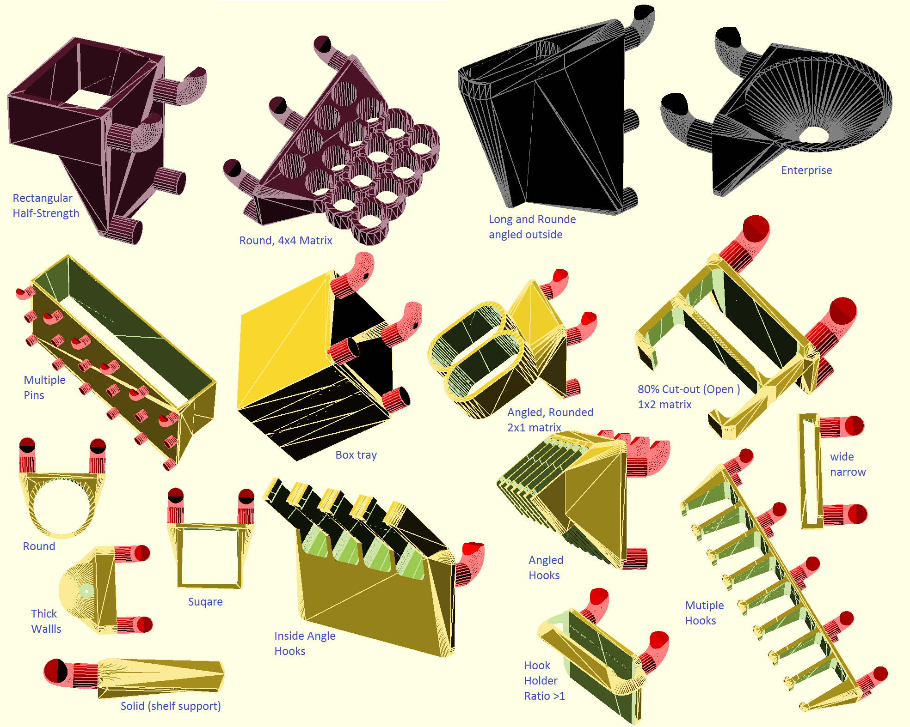
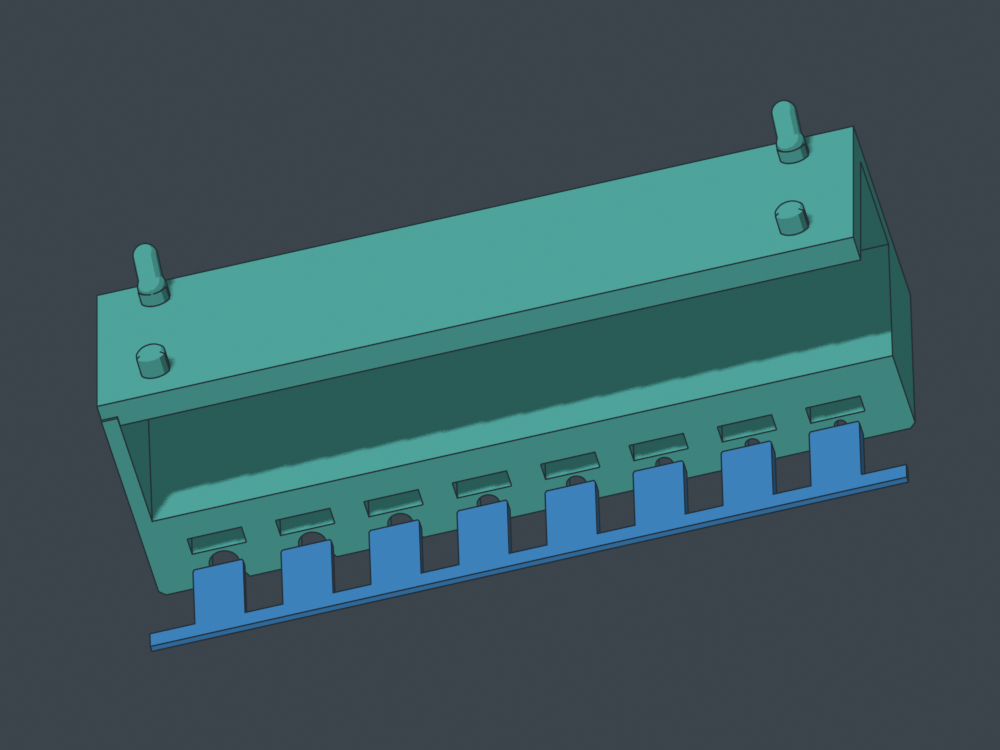
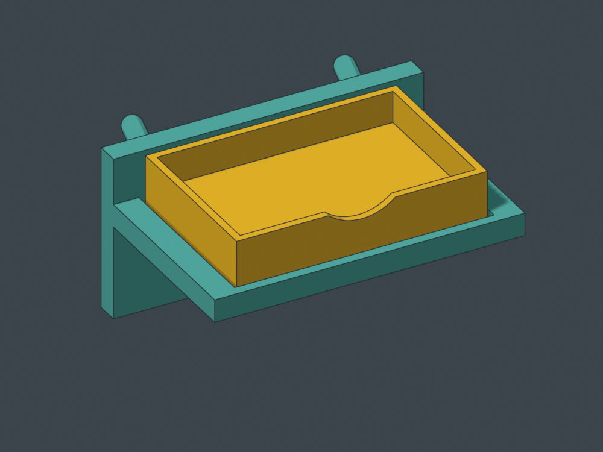
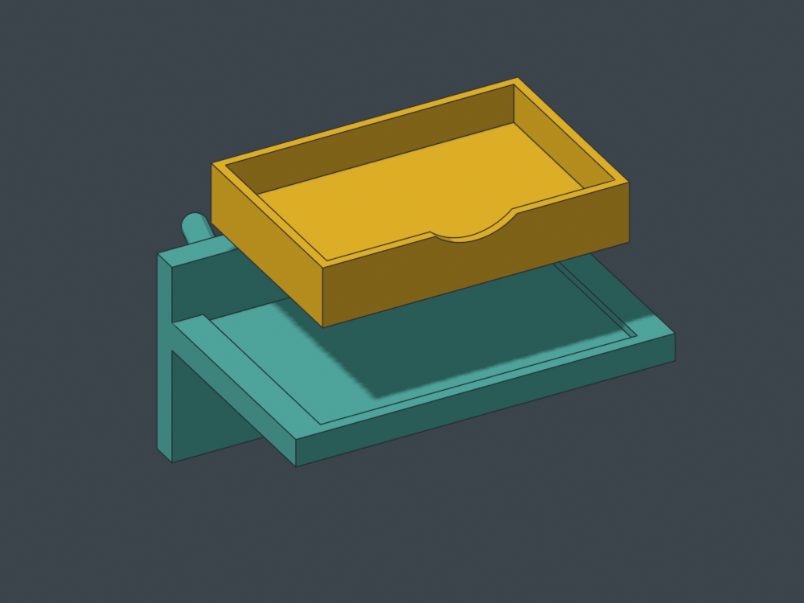
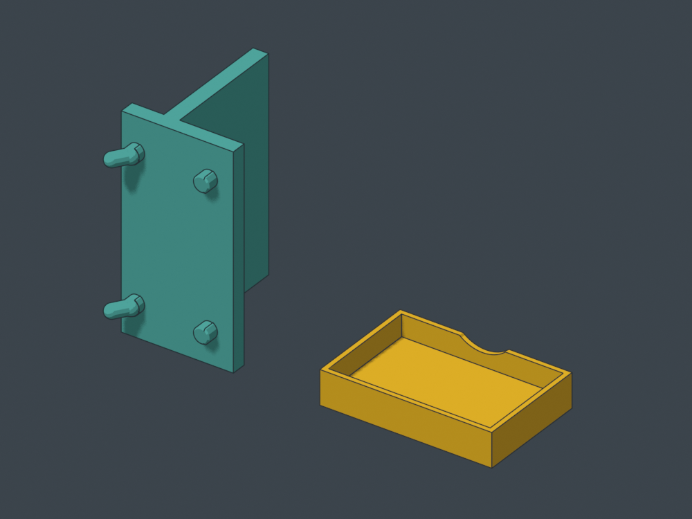

# Pegstr workshop: useful shapes, better daily use

**September 16, 2026 · design review and one new prototype.** Existing gallery models are unchanged. CAD checks, slicing evidence and physical feedback are distinguished below.

## What makes Pegstr work

Pegstr begins with an opening suited to the object and builds a straightforward holder around it. Short sleeves bear on shoulders while leaving the grasp exposed; matrices share walls; deeper pockets preserve orientation; floors turn openings into bins. Width, depth, taper, cut-out, bottom closure, count and reinforcement are useful construction choices, not just styling.

*Original reference illustration: Marius Gheorghescu / mgx, CC BY-NC. [Thingiverse](https://www.thingiverse.com/thing:537516) · [Source](https://github.com/MGX3D/pegstr). The author requests contact before commercial use. These examples do not qualify every generated variation.*

| Strength to borrow | Limit to address |
|---|---|
| Compact, visible tool seats | Tool pitch is not hand clearance. Pack shafts while leaving grips accessible. |
| Gravity and a clear bearing surface | A long tool may still rock or sweep its tip. Two short separated bearings can be useful. |
| Simple closed openings | They need axial lift. Front access matters below another occupied row. |
| Open-front construction | The entry path can also be an escape path. Retention must match the unwanted motion. |
| A flexible generator | Mixed tools, drip handling, delicate tips and magnetic gaps need specific geometry. |
| A coherent family | Preserve what a holder does through style changes; do not force all jobs into one silhouette. |

## The process worth keeping

**Hold → Grab → Return → choose the print face → develop the geometry in that frame → try the actual tool.**

Name the primary bearing and the unwanted motion. A thick seat can bear and guide at once. Keep the real grasp exposed and the board contact flush. Use two mounting columns where they fit and the current canonical peg source. Module width is occupied cells × 25.4 mm minus 2 mm; tool count is independent of cell count.

Choose the bed face before final massing: right cheek, broad top inverted, useful bottom or a deliberate diagonal face. Local accessible supports are normal. Judge their location and removal rather than treating an enabled-support setting as a defect. A comfortable lift-and-out can be one hand action.

## Existing solder and screwdriver work

The photographed solder tube holder received positive hands-on feedback. Preserve its exposed barrel grips, separate lower seats and two short bearings. The exact photographed export revision was not identified, so this does not qualify every solder-module file. Storage, independent access, braid away from nozzles, removable drip collection and protected tweezer tips remain the jobs.

The **MS01 v3 recoverable A–P sampler** remains the next driver fit trial. Use one owned 20 × 10 × 3 mm magnet across plausible neighboring seats, tape the removable comb, and record letter, actual driver and feel. Then check the chosen neighboring handles and overhead row. No force gauge or extra coupon is required.

A limited review of both frozen holder G-code strips found supports away from the shaft seats and no detected perimeter starts within 0.65 mm of the seat backs above the first layer. Existing pocket checks found no intrusions. Entry lips and endpoints were not separately audited. This establishes no new print blocker; it does not measure surface finish, magnetic feel or future reslices.

[Open the current sampler](../shaft-sampler/recoverable/) · [Solder modules](../solder-modules/)

## SWD01 v1: a screw dish that comes to the work

A **60 × 40 × 12 mm removable dish** sits in a shallow recess on a three-cell, 74.2 mm-wide cradle. Take the dish to the repair and return it to the board. Most of its side wall remains exposed for a pinch grip.

<figure><figcaption>Seated in a shallow locating recess.</figcaption></figure>
<figure><figcaption>Lifted 20 mm for illustration; the sampled removal path used 3.5 mm then forward travel.</figcaption></figure>

Two **20 × 10 × 3 mm magnets** load after printing into underside pockets with removal clearance. Tape retains them for the prototype; peel it to recover them. The floor is continuous, and the front scallop leaves 4.6 mm of wall above it.

Choosing the **right cheek as the cradle's bed face** removed a bulky upright-print foot and reduced installed height from about 76 to 39 mm. The tray prints on its flat bottom.

*Actual mesh renders, not slicer previews. Cradle pegs need local-support review; the tray has two 10.4 mm pocket roofs intended to bridge.*

Independent STEP checks found one valid solid per part, zero seated overlap with contact, clearance for both nominal magnets and no collision in sampled lift-and-forward poses. Bed-contact areas are approximately 455 mm² for the cradle and 1,976 mm² for the tray. These are CAD checks, not proof of adhesion, strength, bridge finish or hand feel.

**Form-review prototype — unsliced and physically untested.**

- [STEP/STL review bundle, source and notes](https://github.com/thereprocase/peg/releases/download/swd01-workshop-v1-20260916/part-swd01-screw-dish-magnetic__v1__public-review-bundle__fit-e586ab4ff6.zip)
- [Assembly STEP](https://github.com/thereprocase/peg/releases/download/swd01-workshop-v1-20260916/part-swd01-screw-dish-magnetic__v1__assembly-reference__installed__fit-e586ab4ff6.step)
- [Cradle STEP — right-cheek pose](https://github.com/thereprocase/peg/releases/download/swd01-workshop-v1-20260916/part-swd01-screw-dish-magnetic__v1__cradle__print-right-cheek__fit-e586ab4ff6.step)
- [Tray STEP — flat pose](https://github.com/thereprocase/peg/releases/download/swd01-workshop-v1-20260916/part-swd01-screw-dish-magnetic__v1__tray__print-flat.step)
- [Generator source](https://github.com/thereprocase/peg/blob/main/bench/source/screw_dish_magnetic.py)

Built with BlackTower's contribution and independently reviewed by Shelves-Codex. The current tighter peg fit is recorded in each export. A test print should decide recess and grip feel before adding latches or generating variants.

[Back to the curated gallery](../)
